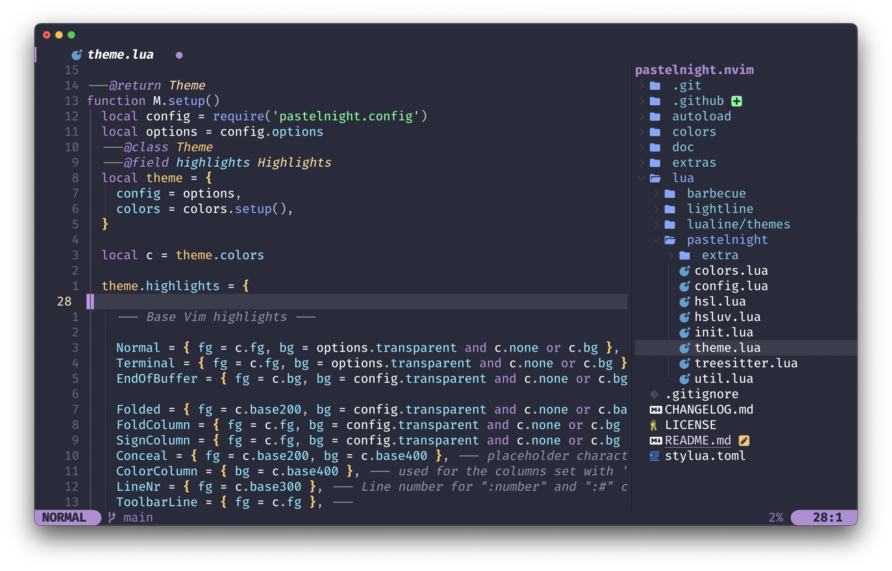

<h1 align="center">PastelNight</h1>
    
<h5 align="center">
  <a href="#-colors">🎨 Palette </a>
  ·
  <a href="#%EF%B8%8F-installation">  ⚡️ Quick Start  </a>
  ·
  <a href="#%EF%B8%8F--configuration"> ⚙️ Configuration </a>
</h5>

<p align="center">
A <a href="https://neovim.io/">Neovim</a> theme inspired on the original <a href="https://github.com/whizkydee/vscode-palenight-theme">Palenight</a> theme, fully written in <a href="https://www.lua.org/">Lua</a>.
</p>



## 🎨 Colors
This palette is improved from the original 16 colors to a 40 shades of those, ensuring compability with more plugins and a smooth contrast experience.


[See the figma document](https://www.figma.com/file/o8nP8nbYI0uvoMmAnyPaCl/Pastelnight-Color-Palette?type=design&node-id=0%3A1&mode=design&t=jXRF6JoGGayRIPxh-1)

## ✨ Features
- Enhances terminal colors.
- Supports all major plugins.
- Supports the latest Neovim 0.9.0 features.
- Introduces a darker background option for sidebar-like windows.

## 🛠️ Installation

### ✋ Requirements
- [Neovim](https://neovim.io/) [7.2](https://github.com/neovim/neovim/releases/tag/v0.7.2) or higher

### ⚡️ Quick Start

First install the theme with your preferred package manager:

#### 💤 lazy.nvim
```lua
{
  "pauchiner/pastelnight.nvim",
  lazy = false,
  priority = 1000,
  opts = {},
}
```

Then set the theme: 

#### 💚 VimScript

```vim
colorscheme pastelnight
```
#### 💙 Lua 

```lua
vim.api.nvim_command [[colorscheme pastelnight]]
```

## ⚙️  Configuration

> [!WARNING]  
> Set the configuration **before** loading the color scheme with `colorscheme pastelnight`.

#### Default Setup
```lua
require("pastelnight").setup({

  --- Enable this to disable setting the background color.
  transparent = false,

  --- Configure the colors used when opening a `:terminal`.
  terminal_colors = true,

  styles = {

    --- Style to be applied to different syntax groups.
    comments = { italic = true },
    keywords = { italic = true },
    functions = {},
    variables = {},

    --- Background styles. Can be 'dark', 'transparent' or 'normal'.
    sidebars = "dark",
    floats = "dark",
  },

  --- Set a darker background on sidebar-like windows. ['vista_kind', 'terminal', 'packer'...].
  sidebars = { "qf", "help" },

  --- Enabling this option, will hide inactive statuslines and replace them with a thin border instead.
  hide_inactive_statusline = false,

  --- dims inactive windows.
  dim_inactive = false,

  --- When true, section headers in the lualine theme will be bold.
  lualine_bold = false,

  --- You can override specific color groups to use other groups or a hex color,
  --- function will be called with a ColorScheme table.
  ---@param colors ColorScheme
  on_colors = function(colors) end,

  --- You can override specific highlights to use other groups or a hex color,
  --- function will be called with a Highlights and ColorScheme table.
  ---@param highlights Highlights
  ---@param colors ColorScheme
  on_highlights = function(highlights, colors) end,
})
```

## 🪓 Overriding Highlights

How the highlight groups are calculated:

1. `colors` are determined based on your configuration, with the ability to
   override them using `config.on_colors(colors)`.
1. These `colors` are utilized to generate the highlight groups.
1. `config.on_highlights(highlights, colors)` can be used to override highlight
   groups.

For default values of `colors` and `highlights`, please consult the
[colors.lua](lua/solarized-osaka/colors.lua) file.

### Settings and color alteration demonstration

```lua
require("pastelnight").setup({
  -- disable italic for functions
  styles = {
    functions = {}
  },
  sidebars = { "qf", "vista_kind", "terminal", "packer" },
  -- Change the "hint" color to the "orange" color, and make the "error" color bright red
  on_colors = function(colors)
    colors.hint = colors.orange
    colors.error = "#ff0000"
  end
})
```

### [Borderless Telescope](https://github.com/nvim-telescope/telescope.nvim/wiki/Gallery#borderless) example

```lua
require("pastelnight").setup({
  on_highlights = function(hl, c)
    local prompt = "#2d3149"
    hl.TelescopeNormal = {
      bg = c.bg_dark,
      fg = c.fg_dark,
    }
    hl.TelescopeBorder = {
      bg = c.bg_dark,
      fg = c.bg_dark,
    }
    hl.TelescopePromptNormal = {
      bg = prompt,
    }
    hl.TelescopePromptBorder = {
      bg = prompt,
      fg = prompt,
    }
    hl.TelescopePromptTitle = {
      bg = prompt,
      fg = prompt,
    }
    hl.TelescopePreviewTitle = {
      bg = c.bg_dark,
      fg = c.bg_dark,
    }
    hl.TelescopeResultsTitle = {
      bg = c.bg_dark,
      fg = c.bg_dark,
    }
  end,
})
```
## 🧑‍🤝‍🧑 Contributing

All contributions are welcome:

[CONTRIBUTING.md](https://github.com/pauchiner/pastelnight.nvim/blob/main/.github/CONTRIBUTING.md)

[CODE_OF_CONDUCT.md](https://github.com/pauchiner/pastelnight.nvim/blob/main/.github/CODE_OF_CONDUCT.md)


## 🐾 Credits


This plugin is highly inspired on the structure of the [Solarized Osaka Theme](https://github.com/craftzdog/solarized-osaka.nvim) from [Takuya Matsuyama](https://github.com/Craftzdog), take a look of this work please.

---

<div align="center">
    <sup>With 💚 by Pau García Chiner</sup>
</div>
